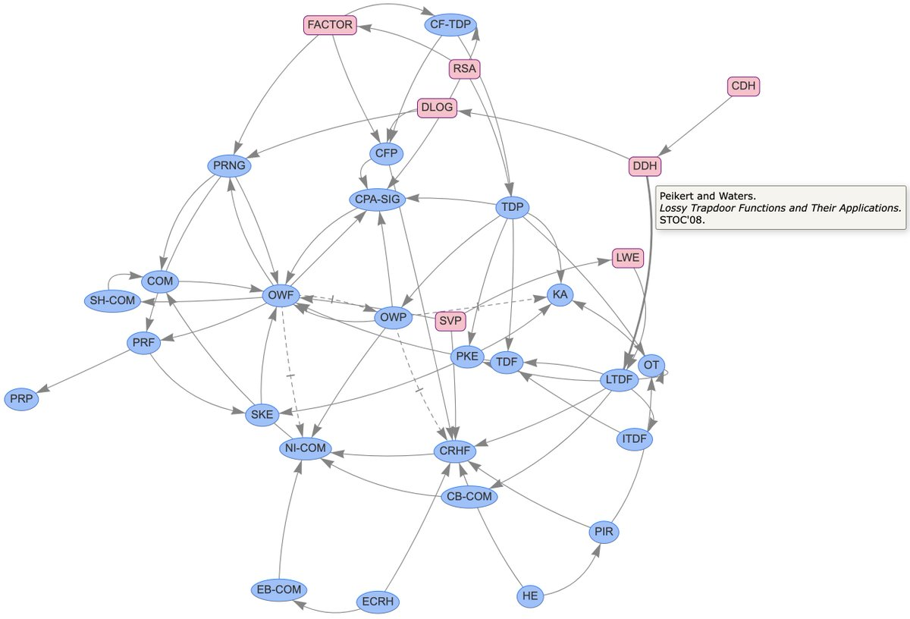

# crypto-graph
An interactive visualization of known implications and separations between quantum cryptographic primitives.
**Contributions are welcome!**

View at [sattath.github.io/qcrypto-graph](https://sattath.github.io/qcrypto-graph/).

<p style="text-align: center;"><a href="https://matthiasgeihs.github.io/crypto-graph/" target="_blank"></a></p>

## Development

You can serve the page locally, for example, using `npm`.
```
npx serve static
```
